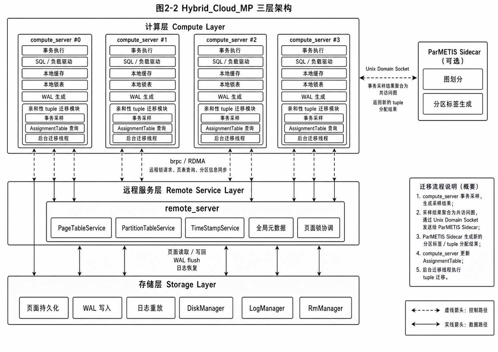
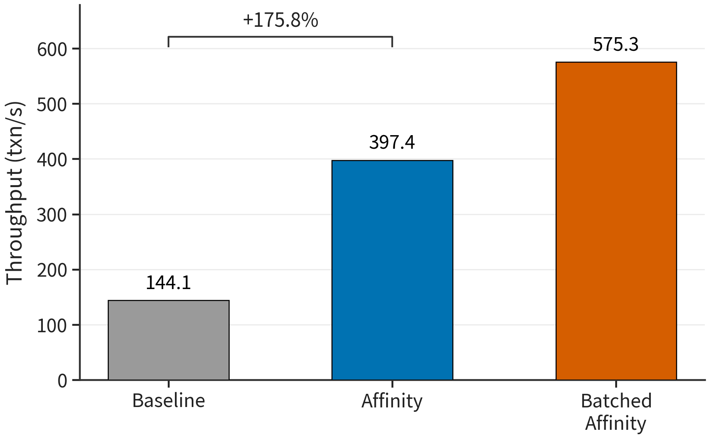
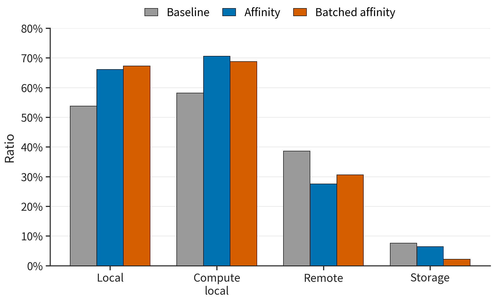
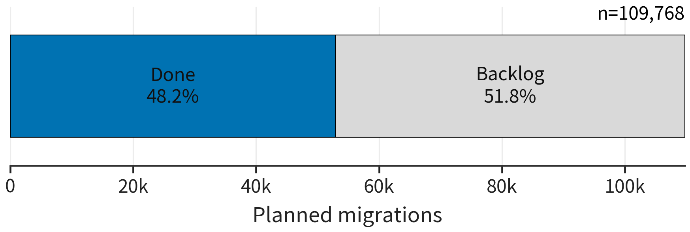
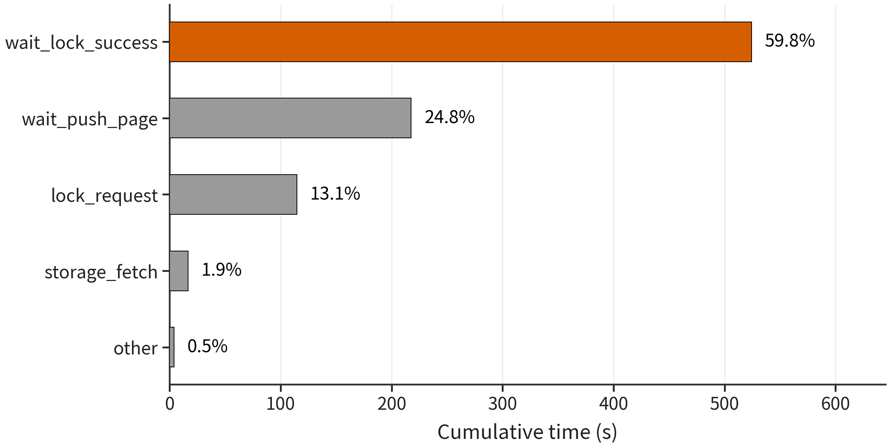
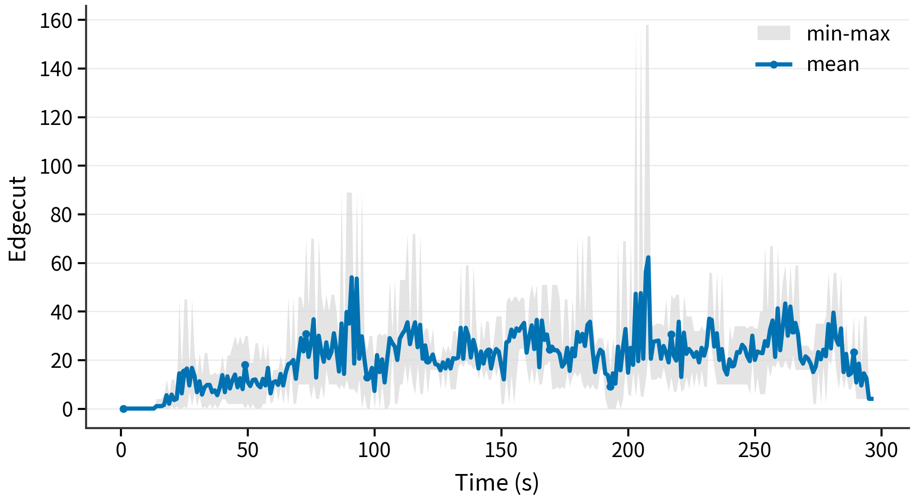
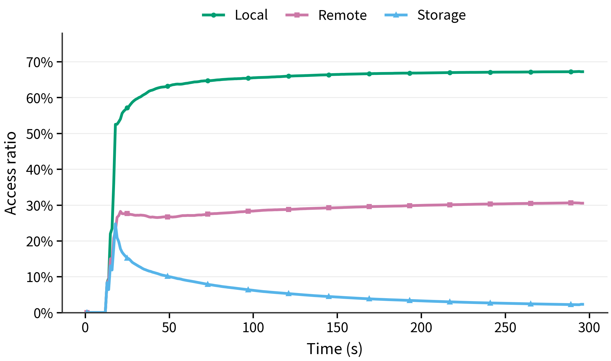
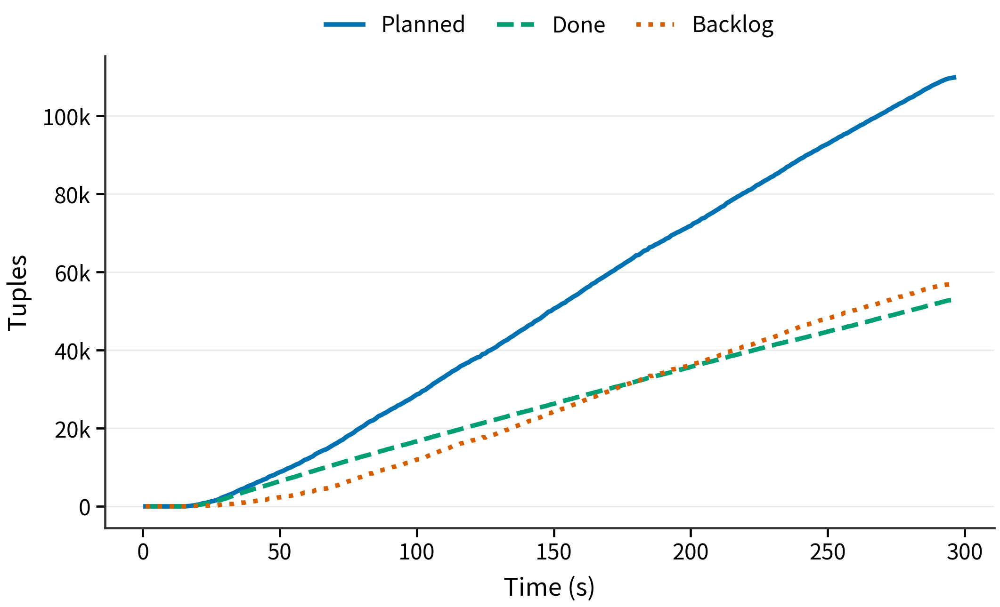

<!--
  排版要求（依《学生学士学位论文（设计）编写格式 2018》）：
  - 用纸：A4；上下页边距 2.54 cm，左右 2.54 cm，页眉 1.5 cm，页脚 1.75 cm。
  - 正文：宋体小四号，1.5 倍行距，字符间距标准（缩放 100%）。
  - 页眉：从正文开始，"成都理工大学****届学士学位论文（设计）"，宋体小五号居中。
  - 页码：小五号字底端居中。
  - 章标题（第1章 等）：黑体小二号居中，段前 0.5 行。
  - 节标题（X.X）：黑体小三号，段前段后各 0.5 行。
  - 小节标题（X.X.X）：黑体小四号，段前段后各 0.5 行。
  - 摘要、Abstract、目录、结论、致谢、参考文献：黑体小二号居中，单独成页。
  - 图：图序图名置于图下方中间，五号黑体；图序按章编排（如图2-5）。
  - 表：表序表名置于表格上方中间，五号黑体；表序按章编排（如表2-5）。
  - 公式：序号按章编排（如(2-1)），右对齐至行末。
  - 参考文献：采用"著者-出版年制"，五号宋体，段前 12 磅，1.5 倍行距，并列入目录；
    条目不排序号，按语种分类（中文、日文、英文……），中文按姓氏笔画或拼音排序，
    英文按第一著者姓氏首字母排序。
  - 正文中引用：著者出现在文中时仅在其后"（）"内注出版年；著者未出现在文中时，
    用"（）"注出著者姓名和出版年，二者间加逗号；同处多篇按出版年由近及远排列，
    中间用分号分开；3 人以上著者标注首位姓氏并加 et al.，2 人用 and 连接。
-->

# 支持多写的OLTP数据库一体机页面亲和性关键技术研究

作者姓名：明泰    专业班级：智能科学与技术4班    指导教师：温泉、卢卫

# 摘  要

云原生数据库通常采用计算存储分离架构，以获得较好的资源弹性和可扩展能力。在共享存储多主数据库中，多个计算节点可以同时执行事务并访问统一存储层的数据页。然而，这类架构也引入了新的性能问题：当同一事务访问的数据项分布在不同计算节点上时，系统需要频繁执行远程锁请求、页面推送、日志等待和页面所有权转移，导致事务执行路径变长，吞吐量下降。传统静态划分或简单哈希路由难以根据运行时事务访问关系动态调整数据布局，因此不能充分利用负载中存在的访问亲和性。

本文围绕共享存储多主数据库中的热点访问局部性问题，设计并实现了一种亲和性 Tuple 迁移技术。该技术以事务实际共同访问的数据项为基础，在线构建 tuple 级亲和图；周期性调用 ParMETIS 对亲和图进行重分区；通过 AssignmentTable 维护 tuple 到目标计算节点的映射；最后由后台迁移线程将目标节点发生变化的 tuple 逐步迁移到更合适的计算节点。为了降低迁移对前台事务的干扰，本文采用限速迁移机制，并进一步将迁移任务按照“源页面、目标节点”进行批量合并，减少重复获取页面锁和重复访问目标页面的开销。

本文在 Hybrid_Cloud_MP 原型系统中实现了完整的亲和性 tuple 迁移流程，包括事务采样、图聚合、边交换、ParMETIS 分区、AssignmentTable 发布、后台迁移、批量迁移以及实验统计工具。基于四个计算节点和一个存储/服务节点的多机实验结果表明，在 SmallBank 亲和负载下，开启亲和机制后系统能够提高本地访问比例并显著降低跨节点访问带来的性能损失。在一组对照实验中，Baseline 集群吞吐量为 144.10 txn/s，开启亲和机制后吞吐量达到 397.40 txn/s，提高约 175.8%；在进一步采用批量迁移优化后的亲和模式实验中，集群吞吐量达到 575.312 txn/s，本地访问比例为 67.26%，计算节点本地访问比例为 68.75%。实验说明，亲和性 tuple 迁移能够有效缓解共享存储多主数据库中的跨节点所有权转移问题，并为后续更细粒度的事务路由和页面布局优化提供基础。

关键词：OLTP数据库一体机；多写事务处理；页面亲和性；Tuple 迁移；ParMETIS

---

# Research on Key Technologies of Page Affinity for Multi-Write OLTP Database Appliance

Abstract：Cloud-native databases often adopt a compute-storage separated architecture to improve elasticity and scalability. In a shared-storage multi-primary database, multiple compute nodes can execute transactions concurrently while accessing the same storage layer. However, this architecture also introduces a performance challenge. When tuples accessed by one transaction are distributed across different compute nodes, the system has to perform remote lock requests, page pushes, log waiting, and page ownership transfers. These operations increase transaction latency and reduce throughput. Static partitioning and simple hash-based placement cannot adapt to runtime transaction affinity, and therefore fail to fully exploit workload locality.

This thesis designs and implements an affinity-aware tuple migration technique for shared-storage multi-primary databases. The proposed method builds an online tuple affinity graph from co-accessed tuples in committed transactions, periodically invokes ParMETIS to repartition the graph, publishes tuple-to-node assignments through an AssignmentTable, and migrates tuples to their preferred compute nodes in a background worker. To reduce interference with foreground transactions, the migration worker is rate-limited. In addition, this thesis groups migration plans by source page and destination node, so that multiple tuples on the same source page can be migrated together with fewer page-lock operations.

The proposed mechanism is implemented in the Hybrid_Cloud_MP prototype system. The implementation includes transaction sampling, graph aggregation, edge exchange, ParMETIS-based repartitioning, AssignmentTable publication, background migration, batched tuple migration, and experiment reporting tools. Experiments on four compute nodes and one storage/service node show that affinity-aware tuple migration improves locality and reduces the cost of cross-node ownership transfers under the SmallBank affinity workload. In one comparison experiment, the baseline cluster throughput is 144.10 txn/s, while the affinity-enabled configuration reaches 397.40 txn/s, achieving a 175.8% improvement. With the batched migration optimization, an affinity-only experiment reaches 575.312 txn/s, with a local access ratio of 67.26% and a compute-local access ratio of 68.75%. These results demonstrate that affinity-aware tuple migration is effective in reducing remote ownership-transfer overhead in shared-storage multi-primary databases.

Key words：OLTP database appliance; multi-write transaction processing; page affinity; tuple migration; ParMETIS

---

# 原创性声明

本人郑重声明：所呈交的学士学位论文（设计）是在指导教师指导下，由本人独立进行研究工作所取得的成果。除文中已经注明引用的内容外，本论文（设计）不包含任何其他个人或集体已经发表或撰写过的研究成果。对本文研究做出重要贡献的个人和集体，均已在文中以明确方式标明。

学生签名：__________

日期：__________

---

# 目录

摘要

Abstract

第1章 绪论

第2章 相关技术与系统背景

第3章 亲和性 Tuple 迁移机制设计

第4章 系统实现

第5章 实验与性能分析

结论与展望

参考文献

致谢

附录

---

# 第1章 绪论

## 1.1 研究背景

随着互联网应用规模持续扩大，数据库系统需要同时满足高吞吐、低延迟、弹性扩缩容和高可用等要求。传统单机数据库通常将计算、缓存、日志和存储紧密耦合在同一节点上，系统结构相对简单，但在面对高并发事务负载时容易受到单机 CPU、内存和存储设备能力的限制。并行数据库和分布式数据库通过多节点并行处理请求，提高了系统整体处理能力（DeWitt and Gray，1992），但也引入了分布式事务、数据划分、网络通信和故障恢复等复杂问题。

云原生数据库的一个重要趋势是计算存储分离。存储层负责数据持久化和日志管理，计算层负责事务执行和查询处理。计算节点可以根据业务负载动态增加或减少，存储层则提供统一的数据访问能力。共享存储多主数据库进一步允许多个计算节点同时处理事务，从而提高系统吞吐量并避免单主节点成为瓶颈。

在共享存储多主数据库中，多个计算节点可能同时缓存同一数据页。为了保证事务隔离性和数据一致性，系统需要维护页面或记录的所有权。当事务需要访问远端节点当前持有的数据页时，系统必须执行远程锁申请、页面传输、日志等待和所有权状态更新。若负载具有较强的数据相关性，而相关数据又被分散在多个计算节点上，则远程所有权转移会频繁发生，成为事务执行的主要开销。

SmallBank 等 OLTP 负载中存在明显的账户访问亲和关系。例如，转账、合并账户、支付等事务通常会同时访问两个或多个账户。如果这些账户长期分布在不同计算节点上，每次事务都可能触发跨节点页面访问。若能根据历史事务访问关系把经常共同访问的 tuple 聚集到同一计算节点，就有机会提高本地访问比例，减少远程页面转移，从而提升整体吞吐量。

## 1.2 研究意义

本文研究的亲和性 tuple 迁移技术在理论、实际、工程与延展四个层面均具有意义。

从理论层面看，本文在共享存储多主数据库的语境下提出并验证了"逻辑分配与后台物理迁移分离"的两阶段思路。已有的工作负载驱动数据划分研究主要面向 shared-nothing 架构，把"分区"与"数据搬运"耦合为同一动作；而在共享存储架构下，数据本身由统一存储层持有，"迁移"实质上是改变 tuple 在计算节点上的归属及其物理页面位置。本文将图划分、AssignmentTable 发布与 tuple 级迁移分别建模为可独立调度的子过程，并通过差异化的运行周期协调三者，为共享存储数据库引入工作负载驱动优化提供了新的参考路径。

从实际层面看，该技术能够直接降低共享存储多主数据库在亲和负载下的所有权转移开销。在 SmallBank 亲和负载的多机实验中，开启亲和机制后集群吞吐量由 144.10 txn/s 提升至 397.40 txn/s（提升约 175.8%），引入批量迁移优化后进一步达到 575.312 txn/s；本地访问比例由 53.75% 提升至 67% 以上，远程访问比例下降约 11 个百分点。这些结果说明，该机制能够在不修改底层存储协议的前提下，通过软件路径改善真实业务场景中的事务延迟与吞吐。

从工程层面看，该技术采用渐进式集成方式：仅在事务提交路径上增加轻量采样，亲和图聚合、ParMETIS 重分区与 tuple 迁移均由后台线程异步执行；ParMETIS 与 MPI 运行时通过侧车进程隔离，不进入数据库主进程的链接关系。这种设计显著降低了已有共享存储数据库引入工作负载驱动优化的门槛，并为通过开关进行 A/B 验证提供了便利。

从研究延展层面看，本文提供的 tuple 级亲和图与 AssignmentTable 接口为后续更细粒度的事务路由、热点页面协调和页级重组奠定了基础。本文实验观察到，在亲和机制启用后，远程锁等待和页面推送上升为主导瓶颈；如何把亲和分配信息进一步用于事务路由策略和页面布局重组，是后续具有持续研究价值的方向。

## 1.3 国内外研究现状

围绕本文工作所涉及的核心问题，本节从工作负载驱动的数据库分区与迁移、并行图划分算法、共享存储多主数据库及现有研究的局限四个方向梳理国内外研究进展。

### 1.3.1 工作负载驱动的数据库分区与迁移

在 shared-nothing 架构下，数据分片质量直接决定了分布式事务的比例与分布式锁、两阶段提交等开销。Schism 首次系统性地把工作负载抽象为图，把元组当作顶点、把同一事务中共同访问的元组对当作带权边，进而通过 METIS 求解最小割来生成数据库分区方案，使大多数事务退化为单分片事务（Curino et al.，2010）。Calvin 通过确定性事务调度回避跨分区两阶段提交，把分布式事务的协调成本降至极低，但其性能仍然依赖良好的初始分片（Thomson et al.，2012）。Stonebraker 等人进一步指出，OLTP 系统应当面向单分区事务进行重新设计（Stonebraker et al.，2007），从而推动了"分区即性能"的研究范式。

然而，上述方法均隐含数据布局相对静态的假设。当业务热点随时间漂移时，初始划分会很快失效。E-Store 通过细粒度的弹性分区，对热点元组进行在线探测与迁移，缓解了静态划分难以适应负载变化的问题（Taft et al.，2014）。这些方法的共同特点是数据本身归属若干物理节点，"迁移"意味着搬运记录、维护跨分片索引并保证分布式事务一致性。

### 1.3.2 并行图划分算法

数据库分区与图划分高度耦合。METIS 提出了多层 k-路图划分算法，能够在维持负载均衡的前提下显著降低割边权重，并在多领域成为事实上的离线划分基线（Karypis and Kumar，1998）。其分布式版本 ParMETIS 进一步支持大规模图的并行划分，并提供自适应重分区能力，能够基于上一轮划分结果以较小迁移代价进行增量调整（Karypis et al.，2003）。增量重分区能力对在线数据库系统尤为关键，因为每一次分区结果的变化都会被映射为后台数据搬运；若每轮都从空白状态重新划分，物理迁移成本将不可承受。本文的分布式图划分流程即建立在 ParMETIS 的自适应重分区能力之上。

### 1.3.3 共享存储多主数据库

在云原生数据库方向，Amazon Aurora 与阿里云 PolarDB 等系统体现了"日志即数据库"的设计思路：把存储层从计算节点解耦，由共享存储承担数据持久化与复制，从而提高弹性与可用性（Verbitski et al.，2017；Cao et al.，2021）。这类系统通常采用单写多读架构，主节点负责写、只读节点共享存储；多主架构则进一步允许多个计算节点同时写入，但需要在共享存储之上协调页面所有权与缓存一致性。Sinfonia 等早期工作从分布式共享数据结构与 mini-transaction 等抽象角度讨论了构建可扩展分布式系统的方法，为共享存储多主数据库的设计提供了基础（Aguilera et al.，2009）。在 OLTP 基准方面，OLTP-Bench 等框架把 SmallBank、TPCC、YCSB 等典型负载整合为统一的实验平台，便于在不同系统下对相同负载进行横向比较（Difallah et al.，2013）。

### 1.3.4 现有研究的局限

综合上述工作可见，工作负载驱动的数据库优化在 shared-nothing 架构下已较为系统，而在共享存储多主数据库语境下仍存在以下局限。第一，shared-nothing 架构的工作负载驱动分区方法不能直接迁移到共享存储多主数据库——后者的数据物理上由统一存储层持有，"迁移"不再意味着搬运数据本身，而是改变页面所有权与计算节点本地缓存的归属关系；其正确性约束（页面锁、Lazy Release 协议、WAL 持久化顺序）也与 shared-nothing 显著不同。第二，已有共享存储数据库主要从存储层一致性、日志复制和缓存协议角度优化性能，对"如何在线调整 tuple 在计算节点上的归属，以减少所有权转移成本"这一问题缺乏系统研究。第三，事务路由类方法虽然可以在一定程度上提升本地缓存命中，但若相关 tuple 所在页面仍由其他节点持有，事务仍然需要触发远程页面获取与所有权转移，效果有限。

本文正是针对上述空白，把工作负载驱动的图划分思路引入共享存储多主数据库，并通过 tuple 级在线迁移把逻辑分配逐步落实为物理局部性，从而在不改变底层存储协议的前提下降低跨节点所有权转移开销。

## 1.4 本文主要工作

本课题在 Hybrid_Cloud_MP 共享存储多主数据库原型系统的基础上开展，作为云原生数据库性能优化方向的子课题，围绕亲和性 tuple 迁移技术展开。系统主要工作如下。

1. 提出面向共享存储多主数据库的 tuple 级亲和图建模方法。系统从成功提交的事务中采样共同访问的 tuple，并将其转换为加权无向图中的边。

2. 设计基于 ParMETIS 的周期性重分区机制。系统定期将亲和图编码为分布式图划分输入，并根据划分结果更新 tuple 到计算节点的 AssignmentTable。

3. 实现低侵入的 AssignmentTable 发布机制。读路径使用快照查找，后台线程负责合并和发布新映射，避免分区更新阻塞前台事务。

4. 设计并实现限速后台 tuple 迁移协议。迁移线程根据 AssignmentTable 生成迁移计划，通过 BLink 索引定位源记录，获取页面锁后复制 tuple、更新索引并删除源 slot。

5. 实现按源页和目标节点合并的批量迁移优化。对于同一源页面、同一目标节点的多个 tuple，系统尽量在一次页面锁持有期间完成多条记录迁移，减少重复锁请求和页面访问。

6. 搭建多机实验脚本和指标汇总工具。实验输出集群吞吐、本地访问比例、远程访问比例、迁移完成数、ParMETIS 边割、所有权转移耗时分解等指标。

本文主要研究成果包括：在 Hybrid_Cloud_MP 中完整实现了从事务采样、图聚合、ParMETIS 重分区、AssignmentTable 发布到后台 tuple 迁移与批量迁移优化的全部模块；在四个计算节点的 SmallBank 亲和负载实验中，相对 Baseline 配置，集群吞吐量提升约 175.8%（144.10 txn/s 提升至 397.40 txn/s），引入批量迁移优化后吞吐进一步达到 575.312 txn/s；本地访问比例从 53.75% 提升至 67% 以上；同时对所有权转移路径进行了细粒度时间分解，量化识别出 `wait_lock_success` 与 `wait_push_page` 是当前主要瓶颈，为后续优化指明方向。

## 1.5 论文组织结构

本文正文共分为五章，并以"结论与展望"作为收束。

第1章介绍研究背景、研究意义、国内外研究现状、本文主要工作和论文结构。

第2章介绍共享存储多主数据库、Lazy Release 页面协议、事务亲和图、ParMETIS 图划分和 SmallBank 负载等相关技术。

第3章给出亲和性 tuple 迁移机制的总体设计，包括系统目标、亲和图构建、分区流程、AssignmentTable、迁移协议和批量迁移优化。

第4章介绍系统实现细节，包括关键模块、数据结构、迁移执行流程和正确性约束。

第5章介绍实验环境、实验参数、评价指标和实验结果，并对性能瓶颈进行分析。

结论与展望部分总结全文工作，并讨论后续可继续优化的方向。

# 第2章 相关技术与系统背景

## 2.1 共享存储多主数据库

共享存储数据库将数据持久化能力放在统一存储层，计算节点通过网络访问存储层的数据页。与 shared-nothing 架构相比，共享存储架构减少了数据复制和重分片的复杂度，计算节点可以更灵活地扩缩容。PolarDB、Amazon Aurora 等云原生数据库系统均体现了计算存储分离和共享存储方向的设计思想（Cao et al.，2021；Verbitski et al.，2017），Sinfonia 等系统也从共享数据结构和小事务抽象角度讨论了分布式系统构建问题（Aguilera et al.，2009）。但由于多个计算节点可能同时访问同一数据页，系统必须维护缓存一致性和页面所有权。

多主共享存储数据库允许多个计算节点同时执行事务。其优势在于提高计算层并行度，避免单一主节点限制吞吐。但该架构也使页面访问路径变复杂：当某个节点需要修改远端节点持有的页面时，必须先获得相应锁或所有权，再执行读写操作。如果同一热点页面在多个节点之间频繁切换，所有权转移成本会显著放大。

### 2.1.1 共享存储架构的特点

共享存储架构的核心特征是“计算节点无状态化趋势”和“数据持久层集中化”。计算节点主要负责 SQL 或事务逻辑、缓存管理、锁管理以及日志生成，存储层负责保存数据页和持久化日志。这样设计的直接好处是扩容简单：当业务请求增多时，可以增加计算节点来分担事务执行压力；当请求减少时，可以减少计算节点以节省资源。由于数据不需要在多个计算节点之间做完整复制，系统在弹性部署方面更方便。

但是，共享存储并不意味着所有节点访问数据的代价相同。事务执行时，计算节点通常会把数据页缓存在本地内存中。如果后续事务继续访问本节点已经缓存并持有所有权的数据页，就可以较快完成读写；如果所需页面正在远端节点上被缓存或持有，则需要进行跨节点协调。对于读操作，系统可能需要确认页面版本是否有效；对于写操作，系统通常需要获得排他权限，并使其他节点上的旧副本失效或等待其推送最新页面。因此，在共享存储多主系统中，计算节点侧的数据局部性仍然非常重要。

### 2.1.2 多主并发下的所有权问题

多主数据库的并发能力来自多个计算节点同时接收和执行事务，但一致性要求决定了同一数据页不能被多个节点无序修改。系统通常会为页面维护一个协调者或所有权状态，用于判断当前哪个节点可以安全读写页面。当事务访问本地已经持有的页面时，路径较短；当事务访问远端页面时，路径会变为“请求远端锁、等待当前持有者释放或推送、安装页面、执行事务、释放或延迟释放”。该路径中的每一步都可能引入网络往返和等待。

本文关注的性能问题正来自这一点。若事务访问关系与数据在计算节点上的分布不匹配，系统即使拥有多个计算节点，也会在所有权转移上消耗大量时间。例如两个账户经常被同一事务同时修改，但它们所在页面长期由不同节点持有，那么事务每次执行都可能跨节点申请锁。随着热点事务数量增加，远程锁等待和页面推送会快速累积，最终抵消多主并行带来的收益。

## 2.2 Lazy Release 页面协议

Hybrid_Cloud_MP 原型系统支持 Lazy 页面获取与释放策略。在 Lazy 模式下，计算节点不会在每次访问结束后立即释放页面所有权，而是尽量保留页面，以便后续事务复用本地缓存。当其他节点需要访问该页面时，系统通过远程页表服务协调锁请求，并在必要时触发页面推送。

Lazy Release 的基本流程如图2-1 所示。

```text
事务请求 -> 本地锁表检查 -> 远程页表请求 -> 页面获取/推送 -> 本地执行 -> 延迟释放
```

图2-1 Lazy Release 页面访问流程

该机制在访问局部性较强时能够减少重复远程访问。但当负载中存在跨节点相关访问时，页面所有权仍可能频繁迁移，导致事务等待远程锁释放、页面推送和日志落盘。

Lazy Release 的优势和局限都比较明显。它假设“刚被访问过的数据很可能再次被同一节点访问”，因此延迟释放页面可以减少后续事务的远程获取成本。对于热点集中且事务路由稳定的场景，这一假设通常成立。但对于亲和关系复杂的负载，仅靠 Lazy Release 不能主动改变数据布局。如果两个强相关 tuple 分别位于不同节点，Lazy Release 只能让各自节点继续保留自己的页面，而不能把相关 tuple 聚集到同一节点。此时系统仍会在事务执行时不断跨节点协调。

从实验观察看，Lazy Release 路径中的主要开销并不只是普通网络 RPC，而是包含锁等待、页面推送和日志刷盘等多个阶段。尤其在开启 WAL 的场景中，页面被推送给其他节点前需要保证相关日志已经持久化，否则恢复时可能出现页面状态和日志状态不一致的问题。因此，远程所有权转移会被日志路径进一步放大。本文的亲和迁移并不替代 Lazy Release，而是作为其上层优化：通过让未来事务更可能访问本地 tuple，减少进入 Lazy Release 远程路径的次数。

## 2.3 事务亲和图

事务处理系统通常需要在并发控制、日志恢复和数据访问路径之间取得平衡（Gray and Reuter，1993）。事务亲和图用于刻画数据项之间的共同访问关系。设一个事务访问 tuple 集合为：

```text
A(T) = {t1, t2, ..., tk}
```

若两个 tuple 在同一事务中被共同访问，则认为它们之间存在亲和关系。系统可以为任意 `i < j` 的 tuple 对建立边：

```text
w(ti, tj) = w(ti, tj) + 1                         (2-1)
```

其中，`w(ti, tj)` 表示两个 tuple 在历史采样窗口内共同出现的次数。边权越高，说明这两个 tuple 越应该被放到同一计算节点，以减少跨节点事务执行成本。

事务亲和图的优点在于它直接来自真实负载，而不是来自静态 schema 或人工规则。数据库中的表结构只能说明数据之间可能存在的业务关系，但不能说明某一时间段内哪些数据真正被频繁共同访问。例如银行系统中任意两个账户都可能发生转账，但只有一部分账户对会在近期高频交互。通过运行时采样，系统能够把这些近期热点关系记录到图中，并随着时间变化逐步更新。

在本文实现中，亲和图采用普通加权无向图，而不是超图。严格来说，一个事务访问多个 tuple 时，更自然的建模方式是超边，因为这些 tuple 是作为一个整体共同出现的。本文采用两两展开的方式，把一个包含 `k` 个 tuple 的事务转换为最多 `k(k-1)/2` 条普通边。这样做的原因是普通图更容易与 ParMETIS 集成，工程实现也更简单。虽然两两展开会丢失一部分事务整体结构，但对于 SmallBank 这类单个事务访问 tuple 数量较少的负载，该近似能够较好表达访问亲和关系。

亲和图还需要避免噪声。偶然共同出现一次的 tuple 不一定具有稳定亲和关系，如果所有弱边都进入分区器，可能导致分区结果抖动。本文通过边权阈值、周期性衰减和 AssignmentTable TTL 控制图规模，使系统更关注近期持续出现的访问关系。

## 2.4 ParMETIS 图划分

ParMETIS 是并行图划分工具，能够在多个进程之间处理分布式图划分问题（Karypis et al.，2003；Karypis and Kumar，1998）。本文使用 ParMETIS 的 adaptive repartition 能力，将上一轮分区结果作为输入，使新分区在降低边割的同时控制迁移规模。

对于亲和图 `G = (V, E)`，划分目标可以描述为：

```text
minimize EdgeCut(G)
subject to LoadBalance(P) <= ubvec                 (2-2)
```

其中，`EdgeCut(G)` 表示被划分到不同计算节点的边权之和，`LoadBalance(P)` 表示不同分区之间的负载均衡程度。边割越小，说明高亲和 tuple 越倾向于被分配到同一计算节点。

在本文场景中，图划分并不是一次性离线任务，而是周期性在线任务。每一轮分区都基于最近采样窗口中的亲和图，并以上一轮分区结果作为参考。如果完全忽略上一轮结果，分区器可能为了降低少量边割而移动大量 tuple，导致迁移成本过高；如果完全不允许移动，则系统无法适应负载变化。ParMETIS 的 adaptive repartition 能力适合这一场景，因为它可以同时考虑边割、负载均衡和相对上一轮分区的迁移代价。

本文没有把 ParMETIS 直接嵌入事务执行线程，而是通过 sidecar 进程调用。这样设计可以把 MPI 和图划分运行时从数据库主进程中隔离出来，减少工程耦合。事务执行线程只负责采样和查询 AssignmentTable，不直接参与图划分，因此图划分耗时不会直接阻塞正在执行的事务。

## 2.5 SmallBank 负载

SmallBank 是常用的 OLTP 基准负载，用于模拟银行账户事务。典型事务包括查询余额、转账、合并账户、存款、支付等。部分事务会同时访问两个账户，因此天然具有 tuple 亲和关系。OLTP-Bench 等基准测试框架也将 SmallBank 作为分析事务型数据库性能的可选负载之一（Difallah et al.，2013）。

本文实验使用的 `smallbank_aff` 是在 SmallBank 基础上构造的亲和负载。该负载通过 friend-graph 方式使部分账户之间存在更高共同访问概率，从而更容易观察亲和迁移对远程访问和吞吐量的影响。

普通 SmallBank 通常按照账户 id 随机或倾斜访问账户，事务之间虽然存在热点，但账户对之间的长期绑定关系不一定明显。`smallbank_aff` 进一步引入 friend-graph，使某些账户之间更可能被同一事务共同访问。这样构造的负载更能体现亲和迁移的应用场景：如果系统能够识别这些稳定账户关系，并把相关账户逐步迁移到同一计算节点，就可以减少后续事务中的远程所有权转移。

需要注意的是，`smallbank_aff` 对数据库系统的压力比普通 SmallBank 更集中。它会放大跨节点写操作、页面锁等待和 WAL 刷盘之间的耦合关系。如果相关账户分布不合理，baseline 性能可能明显低于普通 SmallBank。因此，本文并不把该负载视为唯一代表性负载，而是把它作为验证亲和迁移机制有效性的压力测试。后续若要证明方法的通用性，还需要在 YCSB、TPC-C 和动态热点负载上继续评估。

## 2.6 Hybrid_Cloud_MP 原型系统

本文的实验载体为 Hybrid_Cloud_MP 共享存储多主数据库原型。该原型采用计算–存储分离的三层架构：存储层、远程服务层与计算层各自独立部署，通过 brpc 进行远程过程调用，部分链路在配置允许时使用 RDMA 加速。三层架构的总体关系如图2-2 所示。



图2-2 Hybrid_Cloud_MP 三层架构

存储层 `storage_server` 负责页面持久化、WAL 写入和日志重放，维护 `DiskManager`、`LogManager` 与 `RmManager` 等模块；远程服务层 `remote_server` 提供全局元数据与锁服务，包括 `PageTableService`、`PartitionTableService` 与 `TimeStampService`；计算层 `compute_server` 负责事务执行与 SQL 处理，每个计算节点独立缓存数据页、维护本地锁表，并支持 SmallBank、YCSB、TPCC 等内置负载驱动。系统支持 eager 与 lazy 两种页面释放策略，并采用 2PL 并发控制（NO_WAIT 与 WAIT_DIE 可配置）。本文的全部实验在 lazy 模式下进行，以便观察页面所有权转移在亲和负载下的行为。

亲和性 tuple 迁移作为新的子模块嵌入该原型。事务采样接入计算节点的事务提交路径；聚合、边交换、ParMETIS 调用与 AssignmentTable 发布均运行在每个计算节点的后台线程中；ParMETIS 计算由独立的侧车进程承担，通过 Unix Domain Socket 与计算节点通信。该集成方式不改变原系统的事务执行主路径与共享存储协议，仅通过配置文件中的 `affinity` 段控制是否启用亲和机制，便于通过开关进行 A/B 验证。

# 第3章 亲和性 Tuple 迁移机制设计

## 3.1 设计目标

本文系统设计目标包括以下四点。

1. **提高本地访问比例**。经常共同访问的 tuple 应尽量迁移到同一计算节点，减少远程页面锁请求和页面所有权转移。

2. **降低前台事务侵入性**。采样和路由查找应足够轻量，不能显著增加事务主路径开销。

3. **控制迁移成本**。迁移线程应限速运行，避免与前台事务大量竞争页面锁、缓存和存储 RPC。

4. **保持系统正确性**。迁移过程中需要保证 BLink 索引、源页面、目标页面和日志状态一致，前台事务不能看到半迁移状态；同时需要遵守事务隔离和并发控制的基本要求（Cahill et al.，2009）。

上述目标之间存在明显矛盾。若系统过于激进地迁移 tuple，可能更快提高本地访问比例，但迁移线程会占用页面锁和存储资源，反而影响前台事务。若系统过于保守地迁移 tuple，则 AssignmentTable 中的理想分配长期无法反映到物理位置，事务仍然需要远程访问。因此，本文采用“在线学习、周期分区、后台限速迁移”的整体策略，把学习和迁移动作从事务主路径中拆出，并通过参数控制后台工作强度。

本文设计还遵循渐进式集成原则。Hybrid_Cloud_MP 已有 Lazy Release、BLink 索引、页面锁和 WAL 机制，亲和迁移不能破坏这些已有路径。因此，系统没有重新设计事务协议，而是在现有事务提交后增加采样，在后台维护 AssignmentTable，并通过已有页面锁接口完成 tuple 复制和删除。这样可以降低实现风险，也便于通过实验逐步分析每个模块对性能的影响。

## 3.2 总体架构

亲和性 tuple 迁移机制由六个核心模块组成，如图3-1 所示。

```text
事务执行
   |
   v
SampleRing  ->  Aggregator  ->  EdgeShuffler
                                      |
                                      v
                              ParMETIS Sidecar
                                      |
                                      v
                              AssignmentTable
                                      |
                                      v
                              MigrationWorker
```

图3-1 亲和性 tuple 迁移总体架构

各模块职责如下。

1. `SampleRing`：在事务提交后记录本事务访问过的 tuple 集合。

2. `Aggregator`：周期性消费采样数据，构建本地亲和图和访问计数。

3. `EdgeShuffler`：在多个计算节点之间交换图边，使全局亲和信息能够被合并。

4. `ParMETIS Sidecar`：执行分布式图划分，输出新的 tuple 到节点映射。

5. `AssignmentTable`：发布和维护最新分区结果，供迁移线程和相关路径查询。

6. `MigrationWorker`：扫描 AssignmentTable，生成迁移计划，并在后台移动 tuple。

从数据流角度看，系统可以分为“观测、决策、执行”三个阶段。观测阶段对应 SampleRing 和 Aggregator，目标是低成本记录事务访问关系；决策阶段对应 EdgeShuffler、ParMETIS Sidecar 和 AssignmentTable，目标是把访问关系转换为新的目标节点；执行阶段对应 MigrationWorker，目标是把逻辑分配逐步落实到物理 tuple 位置。

这种分阶段设计有两个好处。第一，各模块可以按不同周期运行。采样可以在每个事务提交后发生，聚合可以几十毫秒执行一次，分区可以一秒或数秒执行一次，迁移可以按固定 tick 限速执行。第二，各模块失败时的影响范围较小。例如某一轮 ParMETIS 分区失败时，系统仍可继续使用上一轮 AssignmentTable；某些 tuple 迁移失败时，也只影响这些 tuple 的收敛速度，不会阻塞整个数据库。

## 3.3 Tuple 标识与亲和采样

为了统一表示不同表和不同负载中的数据项，系统将 table id 和业务主键打包为全局唯一的 tuple id：

```text
tuple_id = (table_id << 48) | item_key              (3-1)
```

事务提交成功后，系统从读写集合中提取实际访问过的 tuple id。若事务访问的 tuple 数量小于 2，则不会产生亲和边；若访问数量较大，则进行去重和数量上限控制，以避免单个事务产生过多边。

采样伪代码如下。

```text
RecordTxn(T):
    if affinity is disabled:
        return
    items = collect_tuple_ids(T.read_set, T.write_set)
    items = deduplicate(items)
    if size(items) < 2:
        return
    items = cap(items)
    SampleRing.push(items)
```

该设计只在事务提交后执行轻量记录，不在事务执行过程中调用图划分或迁移逻辑，因此对前台路径影响较小。

采样位置选择在提交后还有一个重要原因：只有成功提交的事务才代表系统真实生效的访问关系。如果把已经 abort 的事务也加入亲和图，系统可能会根据未真正发生的数据修改关系做出迁移决策，导致图中出现噪声。对于高冲突负载，abort 事务数量可能较多，这一点尤其重要。

采样内容也需要去重。例如一个事务可能多次读取同一账户，若不去重，该账户会在同一事务内重复参与边构建，导致边权被人为放大。本文在采样时按 tuple id 去重，并设置单事务最大采样数量。该上限可以防止复杂事务一次性产生过多边，保证 Aggregator 的处理时间可控。

## 3.4 亲和图构建与衰减

Aggregator 周期性读取 SampleRing 中的样本，并将每个事务访问集合转换为亲和图中的边。设样本集合为 `{v1, v2, ..., vk}`，则系统对所有 `i < j` 执行：

```text
edge_weight[vi, vj] += 1                           (3-2)
node_access[vi] += 1
node_access[vj] += 1
```

其中，`edge_weight` 表示 tuple 之间的共同访问强度，`node_access` 表示 tuple 在本节点被访问的热度。访问热度可以用于构造 ParMETIS 的顶点权重，避免把大量热点 tuple 迁移到同一节点导致负载不均衡。

为了适应负载变化，系统对历史边权进行衰减：

```text
w_new(e) = decay_factor * w_old(e) + w_observed(e) (3-3)
```

当 `decay_factor` 较小时，系统更关注近期访问模式；当 `decay_factor` 较大时，系统更稳定，但对热点变化反应较慢。本文实验中主要使用固定衰减参数，并把参数扫描作为后续优化方向。

亲和图除了边权以外，还需要记录顶点访问权重。原因是图划分不能只追求边割最小。如果某个分区聚集了大量热点 tuple，虽然边割可能降低，但该节点会承担过多事务请求，形成新的负载不均衡。本文使用顶点访问次数近似表示 tuple 热度，并把该信息作为 ParMETIS 的顶点权重输入，使分区器在降低跨分区边的同时尽量保持各节点负载均衡。

此外，图规模必须受到控制。长时间运行后，如果所有历史 tuple 和边都保留在图中，内存占用会不断增长，分区时间也会增加。本文使用衰减和 TTL 思路处理冷数据：近期不再出现的边权会逐渐降低，长期未被观察到的 assignment 也会被清理。这样系统更关注当前工作集，而不是被早期历史访问模式长期影响。

## 3.5 分布式图划分流程

多机环境下，每个计算节点只能观察本节点执行事务产生的采样。为了得到全局图划分结果，系统需要在节点之间交换边和顶点信息。本文采用三阶段流程。

第一阶段是边交换。每个节点根据 tuple id 的稳定哈希确定边的负责节点，并将本地边发送给对应节点。负责节点合并相同边的权重。

第二阶段是顶点 inventory 交换。各节点交换当前持有或观察到的 tuple 集合，用于构造 ParMETIS 所需的 `vtxdist` 和全局顶点编号。

第三阶段是分区结果分发。ParMETIS 输出每个 tuple 对应的新分区后，各节点将自己负责的 assignment slice 分发给其他节点，使每个计算节点最终都能获得一致的 AssignmentTable 快照。

分布式图划分过程中需要保持 epoch 一致。若不同节点基于不同版本的亲和图或 assignment 更新本地状态，就可能出现某个节点认为 tuple 应迁移到 A，而另一个节点认为应迁移到 B 的情况。本文通过分区周期和 barrier 控制各节点在同一 epoch 上交换信息和发布结果。AssignmentTable 中的每条记录也携带版本信息，便于迁移线程判断计划是否过期。

为了减少分区结果抖动，系统还使用上一轮分区作为 adaptive repartition 的输入。这样 ParMETIS 不会每轮从空白状态重新划分，而是在已有分配基础上做增量调整。对于在线数据库系统，这一点非常关键，因为每一次分区变化都可能触发实际 tuple 迁移。稳定的分区结果可以减少不必要迁移，降低后台线程对前台事务的干扰。

## 3.6 AssignmentTable 设计

AssignmentTable 维护 tuple id 到目标计算节点的映射：

```text
AssignmentTable: tuple_id -> node_id
```

为了避免阻塞前台查询路径，AssignmentTable 采用快照发布方式。后台线程生成新快照后，通过原子指针替换当前快照；读者只读取当前快照，不需要持有全局锁。

查找逻辑如下。

```text
Lookup(tuple_id, fallback_node):
    snapshot = current_assignment
    if tuple_id exists in snapshot:
        return snapshot[tuple_id]
    return fallback_node
```

其中，`fallback_node` 是系统原有的页面归属或哈希归属结果。这样可以保证尚未进入亲和图的冷 tuple 仍然按照原系统逻辑访问，不影响正确性。

需要强调的是，AssignmentTable 表示的是期望归属，而不一定等于当前物理位置。ParMETIS 输出新分区后，tuple 并不会瞬间移动到目标节点，而是由 MigrationWorker 逐步迁移。因此，系统在使用 AssignmentTable 时必须区分“逻辑目标节点”和“当前页面实际所有者”。本文的迁移线程会通过 BLink 索引重新定位 tuple 当前 Rid，并检查源页面是否仍属于本节点，避免基于过期计划移动错误数据。

在当前实现中，事务访问路径仍然主要依赖页面实际位置和已有页面锁协议，AssignmentTable 更多用于指导后台迁移。这样做牺牲了一部分即时路由收益，但降低了正确性风险。若未来要把 AssignmentTable 用于事务路由，还需要处理“事务被路由到目标节点但 tuple 尚未迁移完成”的情况，否则可能引入额外远程跳转。

## 3.7 Tuple 迁移协议

MigrationWorker 根据 AssignmentTable 生成迁移计划。一个迁移计划包含：

```text
Plan = (tuple_id, src_node, dst_node, epoch)        (3-4)
```

其中，`src_node` 是当前源节点，`dst_node` 是 ParMETIS 给出的目标节点，`epoch` 表示该计划对应的 assignment 版本。

一次 tuple 迁移包括以下步骤。

1. 通过 BLink 索引定位 tuple 当前所在的源页面和 slot。

2. 检查源页面当前归属是否仍为本节点，避免对已经迁移过的数据重复迁移。

3. 获取源页面和目标页面的 X 锁，保证迁移期间前台事务不能并发修改目标 tuple。

4. 在目标页面寻找空闲 slot，并复制 tuple key、DataItem 元数据和 value 字节。

5. 更新 BLink 索引，使后续查找指向目标位置。

6. 在源页面清除原 slot，并更新源页面和目标页面的空闲空间信息。

7. 写入 insert/delete 日志，用于恢复时重放迁移结果。

8. 释放页面锁，并根据迁移结果更新统计指标。

迁移需要满足以下不变量。

```text
I1: 任意时刻 BLink 对同一 tuple 至多指向一个有效位置。
I2: 迁移成功后，源 slot 被清除，目标 slot 可被后续事务访问。
I3: 迁移失败时，不能留下可见的半迁移状态。
I4: 未成功迁移的 tuple 不进入 cooldown，后续周期可以重新尝试。
```

迁移协议中最关键的顺序是“先复制目标 tuple，再更新 BLink，最后删除源 slot”。如果先删除源 slot，再更新 BLink，则中间状态下前台事务可能找不到该 tuple；如果先更新 BLink，但目标 slot 尚未完整写入，则前台事务可能读到不完整数据。因此，系统必须在持有页面 X 锁的情况下完成目标写入和索引切换，并在确认 BLink 更新成功后才能清除源位置。

另一个重要细节是 DataItem 锁状态检查。前台事务可能已经获取了 tuple 级锁，但暂时释放了页面锁。如果迁移线程只依赖页面 X 锁，可能会把仍处于事务持有状态的 DataItem 复制到目标页面，导致锁状态跨节点传播。本文实现会检查 DataItem 是否处于 `UNLOCKED` 状态，若不是则跳过该 tuple，等待后续周期再迁移。这样做会降低一次迁移的成功率，但可以避免破坏并发控制语义。

## 3.8 批量迁移优化

初始实现中，MigrationWorker 对每个 tuple 单独执行一次迁移。该方式实现简单，但存在重复开销。如果同一源页面中有多个 tuple 都需要迁移到同一目标节点，逐 tuple 迁移会反复获取同一源页面锁，并反复检查或分配目标页面。

本文进一步实现了按源页面和目标节点合并的批量迁移。系统将迁移计划按照如下 key 分组：

```text
GroupKey = (table_id, src_page, dst_node)           (3-5)
```

对于同一组内的多个 tuple，迁移线程只需获取一次源页面锁，并尽量在同一个目标页面中连续填充多个空闲 slot。该优化的主要收益包括：

1. 减少源页面 X 锁的重复申请和释放。

2. 提高目标页面空间利用率，避免每个 tuple 都分配新页面。

3. 减少 `update_page_space` 和目标页面池维护次数。

4. 在迁移 backlog 较大时提高单位 tick 内的有效迁移数量。

批量迁移并不改变迁移正确性。组内每个 tuple 仍然单独验证 BLink 位置、源 slot 状态和 DataItem 锁状态。只有通过检查的 tuple 才会被复制和提交迁移结果。

批量迁移的本质是减少“固定成本”。一次 tuple 迁移通常包含定位源记录、获取源页锁、获取目标页锁、查找目标空闲 slot、更新页面空闲空间和维护目标页面池等步骤。其中，很多步骤与 tuple 数量无关，而与页面有关。如果同一源页中有多个 tuple 都要去同一目标节点，把这些计划合并后，固定成本可以被多个 tuple 共享。

该优化也有边界。若同一批计划来自不同源页面或不同目标节点，强行合并反而会增加锁持有时间和死锁风险。因此本文只按照 `(table_id, src_page, dst_node)` 合并，这是一个相对保守的粒度。它既能利用同页迁移的局部性，又不会跨多个源页面长时间持有大量锁。实验中，批量迁移后的亲和模式吞吐达到 575.312 txn/s，说明该优化在当前负载下具有实际收益。

# 第4章 系统实现

## 4.1 实现环境

本文基于 Hybrid_Cloud_MP 原型系统实现亲和性 tuple 迁移机制。系统采用 C++ 实现，通信层使用 RPC，图划分部分使用 ParMETIS 和 MPI 运行环境。实验脚本使用 Python 编写，用于同步多机代码、检查 ParMETIS 环境、启动服务、收集结果和汇总指标。

主要代码模块如表4-1 所示。

表4-1 主要实现模块

| 模块 | 文件或目录 | 功能 |
|---|---|---|
| 配置 | `core/affinity/affinity_config.h` | 定义亲和机制参数和 tuple id 编码 |
| 采样 | `core/affinity/sample_buffer.*` | 记录事务访问样本 |
| 聚合 | `core/affinity/aggregator.*` | 构建本地亲和图 |
| 边交换 | `core/affinity/edge_shuffler.*` | 跨节点交换边信息 |
| 分区 | `core/affinity/partitioner.*` | 调用 ParMETIS 并生成 assignment |
| 映射表 | `core/affinity/assignment_table.*` | 发布 tuple 到节点映射 |
| 迁移队列 | `core/affinity/migration_planner.*` | 生成和维护迁移计划 |
| 迁移执行 | `core/affinity/migration_worker.*` | 执行 tuple 迁移 |
| 批量分组 | `core/affinity/migration_batch.h` | 按源页和目标节点合并迁移 |
| 指标 | `core/affinity/affinity_metrics.*` | 记录实验统计 |
| 多机脚本 | `tests/scripts/multinode_parmetis_smoke.py` | 多节点实验自动化 |

## 4.2 事务采样实现

事务执行过程中，系统已经维护事务读写集合。亲和采样模块在事务成功提交之后读取这些集合，将业务 key 转换为 tuple id 并写入 SampleRing。这样可以避免 aborted transaction 的访问集合污染亲和图。

SampleRing 的设计重点是低开销。前台线程只进行简单写入，不执行复杂图处理。Aggregator 后台线程周期性 drain 样本，将样本转换为边权累加。

为了便于在多 worker 环境下使用，采样模块尽量避免全局锁竞争。每个 worker 可以把采样写入本地或低竞争的缓冲区，Aggregator 再批量读取。这样即使事务提交频率较高，采样开销也不会随着计算节点数线性放大到不可接受的程度。对于本文实验，事务访问集合通常较小，因此采样数据结构可以保持简单。

采样模块还需要过滤系统表和非业务 tuple。本文主要关注 SmallBank 业务账户数据，不希望 BLink 元数据页、FSM 页或系统内部记录进入亲和图。否则 ParMETIS 可能把系统元数据误认为热点业务数据，导致迁移计划没有实际意义。

## 4.3 ParMETIS 侧车进程

直接在数据库主进程中链接 ParMETIS 和 MPI 会增加部署复杂度，也可能影响主进程稳定性。本文采用 sidecar 设计：数据库主进程通过 Unix Domain Socket 将图划分请求发送给侧车进程，侧车进程负责调用 ParMETIS 并返回分区结果。

该设计具有两个优点。

第一，数据库主进程不需要直接管理 MPI 生命周期，降低工程复杂度。

第二，ParMETIS 出现错误时更容易隔离，不会直接破坏事务执行主进程。

侧车进程和主进程之间传输的是图划分请求和结果。请求中包含本地顶点范围、CSR 邻接表、边权、顶点权重和上一轮分区信息。侧车进程完成 ParMETIS 调用后，把本 rank 的分区结果返回给主进程。主进程再把结果转换为 tuple 到 node 的 assignment，并参与后续分发。

这种 sidecar 方式也便于部署前置检查。多机实验脚本在正式启动 workload 前会先检查每台机器的 ParMETIS 和 METIS 库是否可用，避免运行到分区阶段才失败。对于需要多节点协同的实验，这类环境检查非常重要，因为任意一台机器缺少依赖都可能导致整轮实验失败。

## 4.4 迁移队列实现

MigrationQueue 负责保存待迁移 tuple。为了避免同一 tuple 被重复加入队列，系统维护 `in_flight` 集合。若某个 tuple 已经处于待迁移或正在迁移状态，新计划不会重复入队。

迁移成功后，tuple 会进入短期 cooldown，避免在连续分区周期中被来回迁移。迁移失败则不进入 cooldown，使系统可以在后续 tick 中重新尝试。

队列设计需要在“新鲜度”和“稳定性”之间折中。如果保留所有历史计划，队列可能积压大量已经不再重要的迁移任务；如果每轮都丢弃旧任务，则可能导致系统不断规划但很少真正完成迁移。本文当前保留未完成计划，并通过 in-flight 去重避免重复入队。实验表明，简单丢弃旧队列虽然可以降低 backlog 指标，但会显著降低吞吐，因此没有采用该策略。

迁移队列中的计划只保存 tuple id、源节点、目标节点和 epoch，而不长期保存源 Rid。原因是 tuple 可能已经被其他迁移或前台操作改变位置。真正执行迁移前，MigrationWorker 会重新通过 BLink 查找当前 Rid，并重新验证页面归属。这种“执行前再解析”的方式可以降低过期计划造成的错误。

## 4.5 批量迁移实现

批量迁移新增 `MigrationGroupKey` 和 `BuildMigrationGroups`。`MigrationGroupKey` 包含 `table_id`、`src_page` 和 `dst_node`。MigrationWorker drain 出一批计划后，先解析每个 tuple 当前的源 Rid，再根据 group key 建立分组。

批量迁移的核心流程如下。

```text
MigrateBatch(batch):
    resolved = ResolvePlans(batch)
    groups = BuildMigrationGroups(resolved)
    for group in groups:
        LoadTableLayout(group.table_id)
        while group has pending tuples:
            dst_page = AcquireDestinationPage(group.dst_node)
            lock source page and destination page
            for tuple in group:
                validate source slot and BLink
                copy tuple to destination slot
                update BLink
                clear source slot
                append WAL records
            release pages
            update page free-space metadata
```

在具体实现中，系统按页面号顺序获取源页面和目标页面的 X 锁，避免死锁。若目标页面已满，则从目标页面池中获取下一页继续迁移剩余 tuple。若某个 tuple 的源 slot 已经无效、BLink 已改变或 DataItem 仍处于加锁状态，则跳过该 tuple，并在后续周期重新尝试。

目标页面池用于复用已经分配给某个目标节点但尚未填满的页面。没有页面池时，每迁移一个 tuple 都可能分配新页面，导致空间利用率极低，也会增加元数据维护成本。页面池按 `(table_id, dst_node)` 维护，优先返回仍有空闲 slot 的页面。批量迁移会在同一目标页面中尽量连续写入多个 tuple，并在释放锁后更新该页面剩余空间。

批量迁移还保留了逐 tuple 的成功标记。一个 group 中可能只有部分 tuple 迁移成功，例如某些 tuple 被前台事务锁住，某些 tuple 的 BLink 已经变化。系统不会因为组内一个 tuple 失败而回滚整个 group，而是记录每个原始计划的迁移结果。成功的 tuple 进入 cooldown，失败的 tuple 释放 in-flight 状态，后续可重新规划。这种部分成功策略提高了迁移线程的有效工作量。

## 4.6 正确性约束

Tuple 迁移涉及 BLink 索引、源页面、目标页面和日志状态，因此必须谨慎处理失败路径。

当目标 slot 已经写入但 BLink 更新失败时，系统会回滚目标页面 bitmap 和记录计数，避免产生不可达但可见的脏数据。只有 BLink 更新成功后，系统才删除源 slot 并写入删除日志。

当源 tuple 正被前台事务持有锁时，迁移线程不会强行移动该 tuple。这样可以避免把锁状态复制到目标节点，导致提交阶段无法正确释放锁。

当迁移计划过期或源页面已不属于本节点时，迁移直接失败并释放队列状态。失败不会进入 cooldown，因此后续最新 assignment 仍可重新规划该 tuple。

# 第5章 实验与性能分析

## 5.1 实验环境

本文主要多机实验使用 5 台服务器，其中 4 台作为计算节点，1 台作为存储节点和远程服务进程所在节点。各节点均位于 `10.10.2.0/24` 内网网段，通过 SSH 进行实验部署、进程启动和结果收集。节点角色如表5-1 所示。

表5-1 多机实验节点

| 节点 | 角色 |
|---|---|
| `10.10.2.31` | 计算节点 0 |
| `10.10.2.32` | 计算节点 1 |
| `10.10.2.33` | 计算节点 2 |
| `10.10.2.34` | 计算节点 3 |
| `10.10.2.38` | 存储节点 / 远程服务进程 |

通过 SSH 在 5 台机器上采集硬件和软件环境，结果如表5-2 所示。所有节点均为 x86_64 架构，CPU 型号均显示为 Hygon C86 5390 16-core Processor，运行在 KVM 虚拟化环境中。需要说明的是，系统网卡 `enp12s0` 没有通过 `/sys/class/net/*/speed` 上报有效速率，采集结果为 `-1`，因此本文只记录其处于内网同网段，不对具体网络带宽进行额外推断。

表5-2 集群硬件与软件环境

| 节点 | CPU | 内存 | 磁盘 | 网络 | 操作系统与工具 |
|---|---|---|---|---|---|
| `10.10.2.31` | 48 vCPU，1 线程/核，1 NUMA 节点 | 98 GiB | `vda` 256 GiB | `enp12s0`，内网，速率未上报 | Ubuntu 22.04 系列内核 6.8.0-106，GCC 11.4.0，Open MPI 4.1.2，ParMETIS/METIS 已安装 |
| `10.10.2.32` | 24 vCPU，1 线程/核，1 NUMA 节点 | 49 GiB | `vda` 256 GiB | `enp12s0`，内网，速率未上报 | Ubuntu 22.04 系列内核 6.8.0-40，GCC 11.4.0，Open MPI 4.1.2，ParMETIS/METIS 已安装 |
| `10.10.2.33` | 24 vCPU，1 线程/核，1 NUMA 节点 | 49 GiB | `vda` 256 GiB | `enp12s0`，内网，速率未上报 | Ubuntu 22.04 系列内核 6.8.0-40，GCC 11.4.0，Open MPI 4.1.2，ParMETIS/METIS 已安装 |
| `10.10.2.34` | 24 vCPU，1 线程/核，1 NUMA 节点 | 49 GiB | `vda` 256 GiB | `enp12s0`，内网，速率未上报 | Ubuntu 22.04 系列内核 6.8.0-40，GCC 11.4.0，Open MPI 4.1.2，ParMETIS/METIS 已安装 |
| `10.10.2.38` | 24 vCPU，1 线程/核，1 NUMA 节点 | 49 GiB | `vda` 256 GiB | `enp12s0`，内网，速率未上报 | Ubuntu 22.04 系列内核 6.8.0-87，GCC 11.4.0，Open MPI 4.1.2，ParMETIS/METIS 已安装 |

从硬件配置看，`10.10.2.31` 的 CPU 和内存资源高于其他节点，其余四台机器配置基本一致。实验中只有 `10.10.2.31` 到 `10.10.2.34` 作为计算节点参与吞吐统计，`10.10.2.38` 主要承担存储服务和远程服务进程角色。由于节点处于虚拟化环境中，磁盘显示为 256 GiB 的虚拟块设备 `vda`。本文的实验重点是比较同一环境下不同系统配置的相对性能，因此这些虚拟化因素对 Baseline 与 Affinity 的相对比较影响较小。

实验构建模式为 Debug，开启 WAL 日志，使用 ParMETIS 进行周期性重分区。主要运行参数如表5-3 所示。

表5-3 主要实验参数

| 参数 | 值 |
|---|---:|
| workload | `smallbank_aff` |
| compute nodes | 4 |
| threads per compute node | 4 |
| attempted_num | 10000 |
| partition_cycle_ms | 1000 |
| migration_tick_ms | 200 |
| migration_batch | 30 |
| edge_min_weight | 1 |
| WAL | on |

实验脚本在每轮运行前会执行环境检查，确认计算节点和服务节点均能找到 `libparmetis.so`、`libmetis.so`，并确认 Open MPI 可用。随后脚本同步代码、上传配置、编译 Debug 版本、清理旧进程、启动服务和计算节点，最后收集每个节点的结果文件与亲和时间序列。这样可以减少手工启动带来的误差，并保证多轮实验使用相同流程。

## 5.2 评价指标

本文主要使用以下指标评价系统效果。

1. **集群吞吐量**：四个计算节点吞吐量之和，单位为 txn/s。

2. **本地访问比例**：事务访问中直接命中本地计算节点的比例。该指标越高，说明亲和迁移后局部性越好。

3. **计算节点本地访问比例**：排除存储访问后，仅考察计算节点之间访问是否本地化。

4. **远程访问比例**：需要跨计算节点访问的比例。该指标用于诊断，但本文更关注本地访问比例。

5. **迁移完成数**：MigrationWorker 实际完成的 tuple 迁移数量。

6. **迁移 backlog**：已规划但尚未完成的迁移数量，用于判断迁移速度是否跟得上分区变化。

7. **ParMETIS 边割**：划分后跨分区边权，用于衡量亲和图划分质量。

8. **ownership transfer 时间分解**：包括 lock request、wait lock success、wait push page、storage fetch 等阶段，用于分析主要瓶颈。

本文更强调 `local_ratio` 而不是单独强调 `remote_ratio`。原因是远程比例会受到存储读取、冷页加载和统计口径影响，而本地访问比例更直接反映亲和迁移是否把事务访问集中到了本节点。对于共享存储多主数据库，理想状态不是完全没有远程访问，而是让高频、强相关的访问尽可能留在本地，使远程所有权转移不再支配事务执行时间。

同时，本文报告 `compute_local_ratio`，用于排除从存储层读取冷页的影响。若 `local_ratio` 提升但 `compute_local_ratio` 没有提升，说明本地访问改善可能来自存储访问比例变化，而不一定来自计算节点之间的亲和改善；若二者同时提升，则更能说明 tuple 迁移改善了计算节点侧局部性。

## 5.3 对照实验结果

在一组 Baseline 与 Affinity 对照实验中，系统性能如表5-4 所示。

表5-4 Baseline 与 Affinity 对照结果

| 指标 | Baseline | Affinity | 变化 |
|---|---:|---:|---:|
| 集群吞吐量 | 144.10 txn/s | 397.40 txn/s | +175.8% |
| Local Ratio | 53.75% | 66.09% | +12.34 个百分点 |
| Compute Local Ratio | 58.18% | 70.60% | +12.42 个百分点 |
| Remote Ratio | 38.64% | 27.52% | -11.12 个百分点 |
| Storage Ratio | 7.61% | 6.40% | -1.21 个百分点 |
| Partition Runs | 0 | 76 | - |
| Migrations Planned/Done | - | 26254 / 16931 | - |



图5-1 不同配置下的集群吞吐量对比



图5-2 不同配置下的访问来源比例对比

从表5-4、图5-1 和图5-2 可以看出，开启亲和机制后，本地访问比例明显提高，远程访问比例明显下降，集群吞吐量从 144.10 txn/s 提升到 397.40 txn/s。这说明亲和性 tuple 迁移能够把一部分跨节点访问转化为本地访问，并最终反映为吞吐提升。

Baseline 性能较低的原因与 `smallbank_aff` 负载特征密切相关。该负载会使同一事务频繁访问存在 friend 关系的账户，而这些账户在初始状态下并不一定落在同一计算节点。当事务需要同时修改两个分布在不同节点上的账户时，系统会触发 Lazy Release 的远程写路径。该路径不仅需要发送远程锁请求，还可能等待旧持有者推送页面，并在 WAL 开启时等待相关日志刷盘。因而，跨节点访问比例的小幅变化可能被锁等待和日志等待放大为明显吞吐差异。

Affinity 模式的提升来自两个层面。首先，事务采样和 ParMETIS 分区逐步识别出共同访问的账户，把它们分配到同一目标节点，降低后续事务跨节点访问概率。其次，后台 tuple 迁移让这种逻辑分配逐步变为物理局部性，使 BLink 查找最终指向目标节点上的页面。实验中 Local Ratio 和 Compute Local Ratio 均提高 12 个百分点以上，说明亲和机制确实改变了访问局部性，而不只是改变了统计噪声。

## 5.4 批量迁移优化后的实验结果

在实现按源页面和目标节点合并的批量迁移之后，本文使用相同类型负载进行了较长时间的亲和模式实验。实验结果如表5-5 所示。

表5-5 批量迁移优化后的 Affinity 实验结果

| 指标 | 数值 |
|---|---:|
| cluster_throughput_sum | 575.312 txn/s |
| cluster_local_ratio | 67.26% |
| cluster_compute_local_ratio | 68.75% |
| cluster_storage_ratio | 2.17% |
| diagnostic_cluster_remote_ratio | 30.57% |
| max_affinity_partition_runs | 264 |
| avg_affinity_partition_ms_per_run | 91.527 ms |
| affinity_edgecut_final_avg | 4 |
| affinity_cut_ratio_final_avg | 2.22% |
| migrations_planned | 109768 |
| migrations_done | 52913 |
| migrations_failed | 6 |
| migration_backlog | 56855 |
| migration_success_ratio | 48.20% |



图5-3 批量迁移实验中的迁移任务状态

与早期 Affinity 结果相比，批量迁移优化后的实验吞吐量达到 575.312 txn/s。虽然该实验不是与 Baseline 同轮运行的直接对照，但它说明在当前参数下，批量迁移能够支持更高的亲和模式吞吐。

ParMETIS 最终平均 edgecut 为 4，cut ratio 为 2.22%，说明图划分已经能把大部分强亲和边划分到同一分区。与此同时，如图5-3 所示，迁移 backlog 仍然较大，说明分区结果产生的迁移需求仍高于后台迁移线程的消化速度。该现象表明，后续仍需要继续优化迁移速度和迁移优先级。

批量迁移优化前，迁移线程更接近逐 tuple 执行：每个迁移任务都需要独立解析 Rid、获取源页面和目标页面锁、复制数据、更新 BLink 并更新页面空闲空间。对于 `smallbank_aff` 负载，许多待迁移 tuple 来自相同源页面或相同亲和组，逐 tuple 执行会重复支付大量页面级固定成本。批量迁移按 `(table_id, src_page, dst_node)` 分组后，同组 tuple 可以共享源页锁和目标页访问，因此更适合 backlog 较大的场景。

不过，表5-5 也说明当前迁移系统尚未完全收敛。`migrations_planned` 为 109768，而 `migrations_done` 为 52913，仍有 56855 个 backlog。这并不表示实验失败，而是说明在当前 1000 ms 分区周期和 200 ms 迁移 tick 下，图划分产生新计划的速度仍然较快。若继续提高 `migration_batch`，可能减少 backlog，但也可能加重前台锁竞争。因此，迁移强度需要结合吞吐、锁等待和 backlog 综合选择，而不能只追求迁移完成比例。

## 5.5 Ownership Transfer 时间分析

批量迁移优化后的实验中，所有权转移时间分解如表5-6 所示。

表5-6 Ownership Transfer 时间分解

| 阶段 | 累计耗时 | 占比 |
|---|---:|---:|
| total | 877.350 s | 100.00% |
| wait_lock_success | 524.481 s | 59.78% |
| wait_push_page | 217.541 s | 24.80% |
| lock_request | 114.771 s | 13.08% |
| storage_fetch | 16.566 s | 1.89% |
| other | 3.991 s | 0.45% |



图5-4 Ownership Transfer 累计耗时分解

从表5-6 和图5-4 可以看出，`wait_lock_success` 是最大的时间开销，占 ownership transfer 总耗时约 59.78%。这说明当前系统的主要瓶颈已经不是单纯的存储读取，而是页面或 tuple 热点导致的锁等待和所有权协调。`wait_push_page` 占比约 24.80%，说明页面推送仍然是重要开销。

因此，亲和性 tuple 迁移的收益来源主要有两个方面。一方面，它提高本地访问比例，减少后续事务进入远程所有权转移路径的概率；另一方面，批量迁移减少了后台迁移本身对页面锁和目标页面的重复操作。但是，当热点页面仍然被多个节点争用时，锁等待仍可能成为主要瓶颈。

`wait_lock_success` 占比最高，说明系统在等待远端锁成功通知时消耗了最多时间。这通常对应某个页面当前正被其他节点以排他方式持有，或正在经历 pending wave。亲和迁移可以减少未来进入该路径的次数，但无法立即消除已经存在的热点页面竞争。若多个计算节点仍然持续写同一热点页面，即使 tuple 级 assignment 已经改善，页面级锁粒度仍可能造成等待。

`wait_push_page` 占比第二，说明页面推送也是重要成本。页面推送通常需要旧持有者把最新页面传给新请求者，并在 WAL 开启时保证页面对应日志已经满足持久化要求。该成本与日志系统、页面大小、网络传输和旧持有者当前负载有关。本文的 tuple 迁移从长期看可以降低页面推送频率，但短期内迁移本身也需要写日志和修改页面，因此需要限速。

`storage_fetch` 占比相对较低，说明本轮实验中主要瓶颈不是从存储层冷读页面，而是计算节点之间的所有权协调。这一结果进一步支持本文的优化方向：相比单纯优化存储读取，降低跨节点 ownership transfer 更能改善当前负载下的系统性能。

## 5.6 参数影响分析

本文实验过程中重点观察了 `partition_cycle_ms`、`migration_batch` 和 `edge_min_weight` 三个参数。

`partition_cycle_ms` 表示 ParMETIS 重分区周期。周期较短时，系统能更快响应负载变化，但会产生更多分区开销和 assignment 更新；周期较长时，系统更稳定，但可能不能及时适应热点变化。

`migration_batch` 表示每个迁移 tick 最多处理的迁移计划数量。该值过小会导致 backlog 积压，AssignmentTable 与物理数据位置长期不一致；该值过大则可能与前台事务竞争页面锁和存储资源。本文最终实验采用 `migration_batch=30`，在稳定性和迁移速度之间取得较好的折中。

`edge_min_weight` 用于过滤过弱的亲和边。若阈值过低，图中会包含大量噪声边，导致分区不稳定；若阈值过高，部分有效亲和关系会被忽略。本文主要采用 `edge_min_weight=1`，保留被观察到的共同访问关系。



图5-5 ParMETIS 边割随时间变化



图5-6 访问来源比例随时间变化



图5-7 迁移任务累计变化

实验过程中还观察到一个重要现象：边割降低并不必然立即带来吞吐最大化。图5-5 显示 ParMETIS 边割在实验过程中持续波动并最终收敛到较低水平，说明逻辑划分质量得到改善；图5-6 显示本地访问比例整体维持在较高水平，说明物理迁移和 AssignmentTable 共同改善了访问局部性；但图5-7 也显示迁移任务仍存在明显积压。ParMETIS 输出的 edgecut 反映的是亲和图上的逻辑划分质量，而吞吐还取决于 tuple 是否已经迁移完成、迁移是否干扰前台事务、页面级锁是否仍存在热点竞争以及 WAL 是否放大 push page 成本。因此，评价亲和机制时不能只看 cut ratio，还需要同时看 Local Ratio、migration backlog 和 ownership transfer 时间分解。

对于 `partition_cycle_ms`，过短周期会让系统频繁重分区，可能导致 assignment 更新快于迁移执行，backlog 增长；过长周期则会让系统响应变慢。对于当前 SmallBank 亲和负载，1000 ms 能够较快观察到收益，但 backlog 较大，说明后续可以尝试 2500 ms、5000 ms 或 10000 ms 等更长周期，以降低迁移计划生成频率。

对于 `migration_batch`，本文曾尝试过简单丢弃旧 backlog 的策略，但实验结果显示吞吐下降。这说明最早进入队列的任务虽然不一定永远最优，但完全丢弃旧任务会破坏迁移连续性，使系统不断重新规划却不能把物理位置稳定收敛。因此，更合理的后续方向不是简单清空队列，而是基于收益估计进行优先级排序，例如优先迁移高访问频率、高边权、低锁冲突且源页中可批量迁移数量较多的 tuple。

## 5.7 实验结论

综合实验结果，可以得到以下结论。

第一，亲和性 tuple 迁移能够有效提高本地访问比例。在对照实验中，Local Ratio 从 53.75% 提升到 66.09%，Compute Local Ratio 从 58.18% 提升到 70.60%。

第二，本地访问比例提升能够转化为吞吐提升。在相同类型负载下，Affinity 的吞吐量明显高于 Baseline，对照实验中提升约 175.8%。

第三，批量迁移能够进一步改善迁移执行效率。按源页面和目标节点合并迁移后，亲和模式实验吞吐达到 575.312 txn/s，说明减少重复页面锁操作具有实际价值。

第四，当前系统仍存在迁移 backlog 和锁等待问题。即使 ParMETIS 边割已经较低，后台迁移仍可能跟不上分区变化，且 ownership transfer 中 `wait_lock_success` 占比最高。后续需要继续优化迁移优先级、热点页面协调和事务路由策略。

# 结论与展望

## 1 工作总结

本文针对共享存储多主数据库中的跨节点访问和页面所有权转移问题，提出并实现了一种亲和性 tuple 迁移技术。该技术通过在线采样事务访问集合构建 tuple 亲和图，使用 ParMETIS 周期性重分区，并由后台迁移线程逐步将 tuple 移动到更合适的计算节点。

本文完成了从事务采样、图聚合、分布式边交换、ParMETIS 重分区、AssignmentTable 发布到后台 tuple 迁移的完整实现，并进一步提出按源页面与目标节点合并的批量迁移优化。基于 5 台服务器（4 台计算节点、1 台存储/服务节点）的 SmallBank 亲和负载实验显示：开启亲和机制后，集群吞吐量由 144.10 txn/s 提升至 397.40 txn/s，相对 Baseline 提升约 175.8%；引入批量迁移优化后吞吐进一步达到 575.312 txn/s；本地访问比例由 53.75% 提升至 67% 以上，远程访问比例下降约 11 个百分点；ParMETIS 最终平均 edgecut 降至 4，cut ratio 仅 2.22%，说明亲和图划分质量良好。所有权转移路径的细粒度时间分解显示 `wait_lock_success` 占总耗时约 59.78%，`wait_push_page` 占 24.80%，定位了后续优化的关键阶段。

本文的主要贡献可以概括为：

1. 在共享存储多主数据库语境下，提出了 tuple 级亲和图模型，并将"逻辑分配"与"后台物理迁移"在调度上解耦，使三者按不同时间尺度协同工作。

2. 实现了基于 ParMETIS 自适应重分区的在线动态分区流程，并通过侧车进程把 MPI 与 ParMETIS 运行时从主进程隔离，降低了工程耦合。

3. 实现了快照式 AssignmentTable 与限速后台迁移机制，避免分区更新阻塞前台事务，并通过 in-flight 去重与 cooldown 控制迁移行为。

4. 实现了按 `(table_id, src_page, dst_node)` 合并的批量迁移优化，降低源页锁与目标页面池的重复开销，并通过实验验证其有效性。

5. 通过多机实验系统量化了亲和机制对本地访问比例、吞吐量、ParMETIS 边割与所有权转移耗时分布的影响，并定位了后续可继续优化的关键瓶颈。

## 2 不足之处

本文工作仍存在以下不足。

第一，当前实验主要集中在 SmallBank 亲和负载上，尚未充分覆盖 YCSB、TPC-C 等更多负载。

第二，迁移 backlog 仍然较大，说明迁移计划生成速度和迁移执行速度之间仍需进一步平衡。

第三，当前系统的主要瓶颈之一是锁等待和页面推送，tuple 迁移虽然能够降低远程访问比例，但不能完全消除热点页面上的并发冲突。

第四，BLink 索引和迁移日志的恢复语义仍需要更系统的故障恢复实验验证。

## 3 未来展望

后续可以从以下方向继续优化。

1. **事务路由优化**。根据事务即将访问的 tuple 集合，将事务发送到最适合的计算节点执行，从源头降低 ownership transfer。

2. **迁移优先级优化**。优先迁移高热度、高收益、低冲突的 tuple，避免迁移队列被低收益任务占用。

3. **热点页面协调**。对高写冲突页面引入更细粒度的协调策略，降低 `wait_lock_success` 时间。

4. **页级重组**。将 tuple 迁移与页面布局重组结合，使同一亲和组的 tuple 更集中地分布在少量页面中。

5. **更多负载验证**。扩展到 YCSB、TPC-C 和动态热点负载，验证方法通用性。

# 参考文献

<!-- 著者-出版年制；不排序号；按语种分类（本文献条目均为英文）；同语种内按第一著者姓氏首字母排序。 -->

Aguilera M K, Merchant A, Shah M, et al. 2009. Sinfonia: a new paradigm for building scalable distributed systems[J]. ACM Transactions on Computer Systems, 27(3): 1-48.

Cahill M J, Röhm U, Fekete A D. 2009. Serializable isolation for snapshot databases[J]. ACM Transactions on Database Systems, 34(4): 1-42.

Cao W, Li Z, Wang X, et al. 2021. PolarDB Serverless: a cloud native database for disaggregated data centers[C]//Proceedings of the ACM SIGMOD International Conference on Management of Data: 2477-2489.

Curino C, Jones E P C, Zhang Y, et al. 2010. Schism: a workload-driven approach to database replication and partitioning[J]. Proceedings of the VLDB Endowment, 3(1-2): 48-57.

DeWitt D J, Gray J. 1992. Parallel database systems: the future of high performance database systems[J]. Communications of the ACM, 35(6): 85-98.

Difallah D E, Pavlo A, Curino C, et al. 2013. OLTP-Bench: an extensible testbed for benchmarking relational databases[J]. Proceedings of the VLDB Endowment, 7(4): 277-288.

Gray J, Reuter A. 1993. Transaction Processing: Concepts and Techniques[M]. San Francisco: Morgan Kaufmann.

Karypis G, Kumar V. 1998. A parallel algorithm for multilevel graph partitioning and sparse matrix ordering[J]. Journal of Parallel and Distributed Computing, 48(1): 71-95.

Karypis G, Schloegel K, Kumar V. 2003. ParMETIS: parallel graph partitioning and fill-reducing matrix ordering[CP/OL]. Minneapolis: University of Minnesota.

Stonebraker M, Madden S, Abadi D J, et al. 2007. The end of an architectural era: it is time for a complete rewrite[C]//Proceedings of the International Conference on Very Large Data Bases: 1150-1160.

Taft R, Mansour E, Serafini M, et al. 2014. E-Store: fine-grained elastic partitioning for distributed transaction processing systems[J]. Proceedings of the VLDB Endowment, 8(3): 245-256.

Thomson A, Diamond T, Weng S C, et al. 2012. Calvin: fast distributed transactions for partitioned database systems[C]//Proceedings of the ACM SIGMOD International Conference on Management of Data: 1-12.

Verbitski A, Gupta A, Saha D, et al. 2017. Amazon Aurora: design considerations for high throughput cloud-native relational databases[C]//Proceedings of the ACM SIGMOD International Conference on Management of Data: 1041-1052.

# 致谢

在本论文完成过程中，指导教师在研究方向选择、系统实现和实验分析方面给予了重要指导。本文的实验工作依托 Hybrid_Cloud_MP 原型系统完成，系统开发和调试过程中也得到了同学和实验环境维护人员的帮助。在此向所有给予帮助和支持的老师、同学表示衷心感谢。

同时，感谢开源社区和相关研究工作为本文提供了重要参考。ParMETIS、分布式事务处理、共享存储数据库和动态图划分等方向的已有成果，为本文研究提供了理论基础和工程启发。

# 附录 A 实验启动命令

本文批量迁移优化后的一组多机实验启动命令如下。

```bash
python3 tests/scripts/multinode_parmetis_smoke.py \
  --remote-dir /usr/local/exper/Hybrid_Cloud_MP_rollback_1w \
  --attempted-num 10000 \
  --threads 4 \
  --partition-cycle-ms 1000 \
  --migration-tick-ms 200 \
  --migration-batch 30 \
  --edge-min-weight 1 \
  --timeout 1800
```

# 附录 B 主要实验结果原始摘要

```text
cluster_throughput_sum=575.312000
cluster_local_ratio=0.672575
cluster_compute_local_ratio=0.687516
cluster_storage_ratio=0.021732
max_affinity_partition_runs=264
avg_affinity_partition_ms_per_run=91.527
affinity_edgecut_final_avg=4.000
affinity_cut_ratio_final_avg=0.022238
sum_affinity_migrations_planned=109768
sum_affinity_migrations_done=52913
sum_affinity_migrations_failed=6
sum_affinity_migration_backlog=56855
ownership_transfer_count=271327
ownership_transfer_time_total=877.350000
ownership_transfer_avg_ms=3.233552
ownership_transfer_wait_lock_success_time=524.481000
ownership_transfer_wait_push_page_time=217.541100
```
